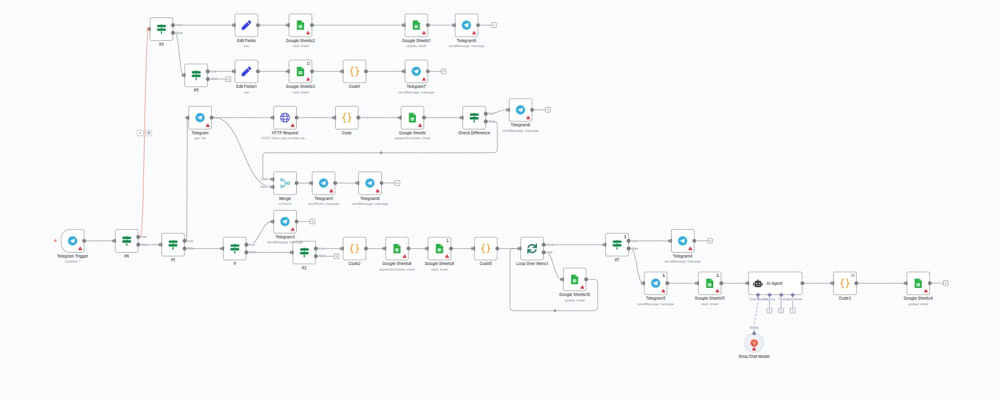

  

# 🤖 n8n-cashflow — AI Receipt Categorizer & Tracker

A powerful and automated workflow for tracking and categorizing your daily expenses via Telegram using OCR and AI.

## 🚀 What It Does

- 📲 Receive receipt images via Telegram bot.
- 🧾 Parse receipts with **Mindee OCR API**:
  - Extract line items
  - Get total amount
  - Identify purchase date and time
- 🔍 Check if the total sum matches the calculated sum from items.
- 🧠 Use **AI model (Groq/OpenAI)** to categorize products into predefined categories:
  - Categories like: `Продукты питания`, `Алкоголь`, `Аптека`, `Гигиена`, `Транспорт`, `Услуги`, etc.
- 📤 Write enriched data into **Google Sheets**:
  - Match by `row_id`
  - Add category, corrected totals
- ✅ Approve or manually edit items via inline Telegram buttons:
  - `approve_`, `manual_`, `set_changes`, `approve_changes`
- 🔁 If mismatch is detected, the system offers you to enter the missing item and rechecks the total.

## 🛠️ Stack Used

- [n8n](https://n8n.io) — Low-code automation platform
- [Mindee](https://mindee.com) — OCR for receipts
- [Telegram Bot API](https://core.telegram.org/bots/api)
- [Groq / OpenAI](https://groq.com) — AI categorization
- Google Sheets — Database for structured expense tracking

## 🧩 Key Nodes Used

- `Telegram Trigger`
- `HTTP Request` to Mindee API
- `Code` (JavaScript) nodes for:
  - Sum comparison
  - Response formatting
- `AI Model` node to classify items
- `Google Sheets` nodes for:
  - Update rows by `row_id`
  - Read/write operations
- `Telegram` interaction nodes for messaging and inline buttons

## 📊 Google Sheets Structure (example)

| row_id        | Название товара | Цена | Кол-во | Сумма по чеку | Категория     |
|---------------|------------------|------|--------|----------------|----------------|
| 175015420700  | Mivolis Laktase  | 5.45 | 1      | 10.65          | Аптека         |

## ⚙️ Setup Instructions

1. 🔐 Setup environment variables in n8n for:
   - Mindee API Key
   - Groq/OpenAI API Key
   - Telegram Bot Token
   - Google Sheets Credentials
2. 🧪 Test Mindee parsing on example receipts.
3. 🧠 Tune AI prompts (optional) for better classification.
4. 🧵 Connect Telegram → n8n → Mindee → AI → Google Sheets.

## 📌 Status

✅ MVP implemented  
🔜 Planned: statistics dashboard, visual reports, spending alerts

---

Made by [Serhii Litus](https://github.com/litus-work)